# Annotator Workflow & Quality System

> Last Updated: February 7, 2026

## Overview

This document details the complete annotator lifecycle on Synapse - from initial signup through task completion, quality assurance, and payments. The platform implements a sophisticated workforce management system that balances quality, speed, and annotator earnings.

---

## Table of Contents

1. [Annotator Onboarding](#annotator-onboarding)
2. [Skill Assessment System](#skill-assessment-system)
3. [Expertise System](#expertise-system)
4. [Task Assignment Engine](#task-assignment-engine)
5. [Annotation Workflow](#annotation-workflow)
6. [Quality Assurance](#quality-assurance)
7. [Trust Level System](#trust-level-system)
8. [Expert Review Process](#expert-review-process)
9. [Gamification & Rewards](#gamification--rewards)
10. [Payment & Payouts](#payment--payouts)

---

## Annotator Onboarding

### Registration Flow

```
┌──────────────────┐
│  Landing Page    │
│  (/annotators)   │
└────────┬─────────┘
         │
         ▼
┌──────────────────┐
│  Signup Form     │
│  - Email         │
│  - Password      │
│  - Full Name     │
│  - Phone Number  │
└────────┬─────────┘
         │
         ▼
┌──────────────────┐
│ Email Verification│
│ (6-digit code)   │
└────────┬─────────┘
         │
         ▼
┌──────────────────┐
│ Profile Setup    │
│ - Language       │
│ - Education      │
│ - Skills         │
│ - Availability   │
└────────┬─────────┘
         │
         ▼
┌──────────────────┐
│ Qualification    │
│ Test Required    │
└──────────────────┘
```

### User Types

| Role | Description | Access |
|------|-------------|--------|
| **Client** | Creates projects, imports data, pays for annotations | Full project management |
| **Annotator** | Completes annotation tasks | Task interface, earnings dashboard |
| **Expert Annotator** | Reviews others' work | Expert review queue |
| **Expert Reviewer** | Final quality check | Review interface |
| **Admin** | Platform management | Admin dashboard |

### Profile Fields

```python
# AnnotatorProfile fields
class AnnotatorProfile(models.Model):
    user = models.OneToOneField(User)
    
    # Status
    is_approved = models.BooleanField(default=False)
    is_verified = models.BooleanField(default=False)
    
    # Skills & Experience
    languages_spoken = models.JSONField(default=list)
    education_level = models.CharField(max_length=50)
    skills = models.JSONField(default=list)
    experience_years = models.IntegerField(default=0)
    
    # Availability
    hours_per_week = models.IntegerField(default=20)
    preferred_project_types = models.JSONField(default=list)
    
    # Quality Metrics
    accuracy_score = models.DecimalField(default=0.0)
    consistency_score = models.DecimalField(default=0.0)
    speed_score = models.DecimalField(default=0.0)
    
    # Trust
    trust_level = models.ForeignKey(TrustLevel)
```

---

## Skill Assessment System

### Test Structure

Before accessing any project, annotators must pass skill tests:

```
┌─────────────────────────────┐
│     PLATFORM TEST           │
│  (Basic qualification)      │
│  - 20 questions             │
│  - 80% pass threshold       │
│  - Tests general skills     │
└──────────────┬──────────────┘
               │ Pass
               ▼
┌─────────────────────────────┐
│     PROJECT TESTS           │
│  (Per-project skills)       │
│  - Custom questions         │
│  - Project-specific rules   │
│  - Configurable threshold   │
└──────────────┬──────────────┘
               │ Pass
               ▼
┌─────────────────────────────┐
│    TASK ASSIGNMENT          │
│  (Start annotating)         │
└─────────────────────────────┘
```

### Platform Test

The base qualification test validates:

1. **Reading Comprehension** - Understanding instructions
2. **Attention to Detail** - Spotting differences
3. **Language Proficiency** - Grammar, spelling
4. **Basic Annotation Skills** - Tool usage
5. **Time Management** - Working under pressure

```python
# Test configuration
PLATFORM_TEST_CONFIG = {
    'total_questions': 20,
    'time_limit_minutes': 30,
    'pass_threshold': 0.80,
    'max_attempts': 3,
    'cooldown_hours': 24,  # Between retakes
}
```

### Project-Specific Tests

Clients can create custom tests:

```python
class ProjectTest(models.Model):
    project = models.ForeignKey(Project)
    title = models.CharField(max_length=200)
    instructions = models.TextField()
    pass_threshold = models.DecimalField(default=0.80)
    time_limit = models.IntegerField(default=1800)  # seconds
    max_attempts = models.IntegerField(default=3)
    is_active = models.BooleanField(default=True)

class TestQuestion(models.Model):
    test = models.ForeignKey(ProjectTest)
    question_type = models.CharField(choices=[
        ('multiple_choice', 'Multiple Choice'),
        ('annotation', 'Annotation Task'),
        ('text_input', 'Text Input'),
    ])
    question_text = models.TextField()
    task_data = models.JSONField(null=True)  # For annotation questions
    correct_answer = models.JSONField()
    points = models.IntegerField(default=1)
```

### Test Results & Tracking

```python
class TestAttempt(models.Model):
    user = models.ForeignKey(User)
    test = models.ForeignKey(ProjectTest)
    score = models.DecimalField()
    passed = models.BooleanField()
    answers = models.JSONField()
    started_at = models.DateTimeField()
    completed_at = models.DateTimeField()
    time_taken = models.IntegerField()  # seconds
```

---

## Expertise System

The platform features a comprehensive expertise and specialization system that allows annotators to demonstrate skills and qualify for specialized tasks.

### Expertise Categories

Top-level annotation domains that map to annotation template folders:

```python
class ExpertiseCategory(models.Model):
    name = models.CharField(max_length=100, unique=True)
    slug = models.SlugField(max_length=100, unique=True)
    description = models.TextField(blank=True)
    icon = models.CharField(max_length=50, blank=True)
    template_folder = models.CharField(max_length=100, blank=True)  # Maps to annotation_templates/
    display_order = models.IntegerField(default=0)
    is_active = models.BooleanField(default=True)
```

**Available Categories:**
- Computer Vision (object detection, segmentation)
- NLP/Text (named entity recognition, classification)
- Audio/Speech (transcription, speaker diarization)
- Medical Imaging (X-ray, MRI, pathology)
- Conversational AI (dialog quality, intent labeling)

### Expertise Specializations

Sub-expertise within categories representing specific skills:

```python
class ExpertiseSpecialization(models.Model):
    category = models.ForeignKey(ExpertiseCategory, on_delete=models.CASCADE)
    name = models.CharField(max_length=100)
    slug = models.SlugField(max_length=100)
    template_folder = models.CharField(max_length=100, blank=True)
    
    # Qualification requirements
    requires_certification = models.BooleanField(default=False)
    certification_instructions = models.TextField(blank=True)
    min_test_questions = models.IntegerField(default=10)
    passing_score = models.IntegerField(default=70)  # Percentage
```

### Annotator Expertise Tracking

Tracks which expertise an annotator has claimed, tested, and verified:

```python
class AnnotatorExpertise(models.Model):
    STATUS_CHOICES = [
        ('claimed', 'Claimed'),       # Annotator said they have this skill
        ('testing', 'Taking Test'),   # Currently taking qualification test
        ('verified', 'Verified'),     # Passed test, can receive tasks
        ('failed', 'Failed Test'),    # Failed qualification, can retry
        ('expired', 'Expired'),       # Needs re-certification
        ('revoked', 'Revoked'),       # Admin revoked (fraud/quality)
    ]
    
    annotator = models.ForeignKey(AnnotatorProfile, on_delete=models.CASCADE)
    category = models.ForeignKey(ExpertiseCategory, on_delete=models.CASCADE)
    specialization = models.ForeignKey(ExpertiseSpecialization, null=True)
    status = models.CharField(max_length=20, choices=STATUS_CHOICES, default='claimed')
    
    # Qualification tracking
    test_attempts = models.IntegerField(default=0)
    last_test_score = models.DecimalField(max_digits=5, decimal_places=2, null=True)
    verified_at = models.DateTimeField(null=True)
    expires_at = models.DateTimeField(null=True)
    
    # Performance metrics
    tasks_completed = models.IntegerField(default=0)
    accuracy_score = models.DecimalField(max_digits=5, decimal_places=2, default=0.0)
    average_time_per_task = models.IntegerField(default=0)  # Seconds
    
    # Email-based test access
    test_token = models.UUIDField(null=True, unique=True)
```

### Expertise Qualification Flow

```mermaid
graph LR
    A[Claim Expertise] --> B[Email Invitation]
    B --> C[Take Test via Token]
    C --> D{Score >= 70%?}
    D -->|Yes| E[Verified ✓]
    D -->|No| F[Failed - Retry Available]
    E --> G[Receive Matching Tasks]
    F --> C
```



1. **Claim**: Annotator selects expertise categories on their profile
2. **Email Token**: System sends test invitation email with unique token link
3. **Qualification Test**: Annotator completes timed test (10+ questions)
4. **Verification**: Passing score (70%+) updates status to "verified"
5. **Task Matching**: Verified expertise enables assignment of matching project tasks

### Frontend Components

- `ExpertiseSection.tsx` - Main expertise display/edit component
- `ExpertiseIcons.tsx` - Category icon rendering
- `SpecialtySelection.tsx` - Multi-select expertise picker
- `TestResultsDisplay.tsx` - Show test scores and status

---

## Task Assignment Engine

### Adaptive Assignment Algorithm

The platform uses an intelligent assignment system:

```python
class AdaptiveAssignmentEngine:
    """
    Assigns tasks based on:
    1. Annotator skills & trust level
    2. Task complexity & requirements
    3. Workload balancing
    4. Historical performance
    5. Availability windows
    """
    
    def get_next_task(self, annotator):
        # Get eligible tasks
        tasks = self.get_eligible_tasks(annotator)
        
        # Score and rank
        scored_tasks = []
        for task in tasks:
            score = self.calculate_match_score(annotator, task)
            scored_tasks.append((task, score))
        
        # Return best match
        return max(scored_tasks, key=lambda x: x[1])[0]
    
    def calculate_match_score(self, annotator, task):
        score = 0
        
        # Skill match
        if task.required_skills <= annotator.skills:
            score += 30
        
        # Trust level requirement
        if annotator.trust_level >= task.min_trust_level:
            score += 20
        
        # Language match
        if task.language in annotator.languages:
            score += 25
        
        # Historical accuracy on similar tasks
        historical = self.get_historical_accuracy(annotator, task.type)
        score += historical * 25
        
        return score
```

### Assignment Configuration

```python
class TaskAssignmentConfig(models.Model):
    project = models.ForeignKey(Project)
    
    # Distribution settings
    distribution_method = models.CharField(choices=[
        ('auto', 'Automatic'),
        ('manual', 'Manual Assignment'),
        ('queue', 'First Come First Serve'),
    ])
    
    # Limits
    max_tasks_per_annotator = models.IntegerField(default=10)
    max_concurrent_assignments = models.IntegerField(default=3)
    
    # Requirements
    min_trust_level = models.ForeignKey(TrustLevel)
    required_skills = models.JSONField(default=list)
    
    # Timeouts
    assignment_timeout_hours = models.IntegerField(default=24)
    auto_reassign = models.BooleanField(default=True)
```

### Task States

```
                    ┌──────────┐
                    │ CREATED  │
                    └────┬─────┘
                         │
                         ▼
┌────────────────────────┴─────────────────────┐
│                   QUEUED                      │
│           (Available for assignment)          │
└────────────────────────┬─────────────────────┘
                         │
              ┌──────────┴──────────┐
              ▼                     ▼
       ┌──────────┐          ┌──────────┐
       │ ASSIGNED │          │ SKIPPED  │
       │  (Locked │          │          │
       │   to     │          └──────────┘
       │ annotator│
       └────┬─────┘
            │
            ▼
       ┌──────────┐
       │ANNOTATION│
       │    IN    │
       │ PROGRESS │
       └────┬─────┘
            │
      ┌─────┴─────┐
      ▼           ▼
┌──────────┐ ┌──────────┐
│SUBMITTED │ │ EXPIRED  │
│          │ │(Timeout) │
└────┬─────┘ └────┬─────┘
     │            │
     │            └──► Re-queue
     ▼
┌──────────┐
│ PENDING  │
│ REVIEW   │
└────┬─────┘
     │
     ├─────────────────┐
     ▼                 ▼
┌──────────┐     ┌──────────┐
│ APPROVED │     │ REJECTED │
│          │     │          │
└────┬─────┘     └────┬─────┘
     │                │
     ▼                ▼
┌──────────┐     ┌──────────┐
│COMPLETED │     │ REWORK   │
│ (Paid)   │     │          │
└──────────┘     └──────────┘
```

---

## Annotation Workflow

### Annotator Dashboard

When an annotator logs in, they see:

1. **Available Tasks** - Tasks matching their skills
2. **Assigned Tasks** - Currently assigned (in progress)
3. **Completed Tasks** - Finished work
4. **Earnings Summary** - Pending and paid amounts
5. **Quality Metrics** - Accuracy, speed scores

### Task Annotation Flow

```
1. VIEW TASK QUEUE
   └── Filter by project, type, pay rate
   
2. CLAIM TASK
   └── Task locked to annotator
   └── Timer starts (if time-limited)
   
3. READ INSTRUCTIONS
   └── Project guidelines
   └── Example annotations
   
4. ANNOTATE
   └── Use annotation tools
   └── Apply labels
   └── Mark regions
   
5. REVIEW WORK
   └── Self-review option
   └── Check completeness
   
6. SUBMIT
   └── Task moves to review queue
   └── Annotator can start next task
```

### Annotation Interface

```
┌────────────────────────────────────────────────────────────┐
│  Toolbar: [Rect] [Polygon] [Brush] [Keypoint] [Undo/Redo] │
├────────────────────────────────────────────────────────────┤
│                                                            │
│                                                            │
│                     Canvas/Media                           │
│                   (Image/Video/Audio/Text)                 │
│                                                            │
│                                                            │
├───────────────────────┬────────────────────────────────────┤
│   Labels Panel        │     Regions List                   │
│                       │                                    │
│   [ ] Person          │   1. Rectangle "Person #1"         │
│   [ ] Vehicle         │   2. Rectangle "Vehicle #1"        │
│   [ ] Animal          │   3. Polygon "Person #2"           │
│                       │                                    │
├───────────────────────┴────────────────────────────────────┤
│   Instructions: Mark all people and vehicles...            │
├────────────────────────────────────────────────────────────┤
│   [Skip Task]    [Save Progress]    [Submit Annotation]    │
└────────────────────────────────────────────────────────────┘
```

---

## Quality Assurance

### Multi-Layer QA System

```
┌─────────────────────────────────────────────────────┐
│                LAYER 1: AUTOMATED                   │
│  - Schema validation                                │
│  - Completeness checks                              │
│  - Rule-based validation                            │
└─────────────────────────────────────────────────────┘
                         │
                         ▼
┌─────────────────────────────────────────────────────┐
│                LAYER 2: CONSENSUS                   │
│  - Multi-annotator agreement                        │
│  - Majority voting                                  │
│  - Disagreement flagging                            │
└─────────────────────────────────────────────────────┘
                         │
                         ▼
┌─────────────────────────────────────────────────────┐
│                LAYER 3: HONEYPOT                    │
│  - Hidden test tasks                                │
│  - Known ground truth                               │
│  - Silent accuracy tracking                         │
└─────────────────────────────────────────────────────┘
                         │
                         ▼
┌─────────────────────────────────────────────────────┐
│               LAYER 4: EXPERT REVIEW                │
│  - Sample-based review                              │
│  - Full review for critical tasks                   │
│  - Final quality arbitration                        │
└─────────────────────────────────────────────────────┘
```

### Automated Validation

```python
class AnnotationValidator:
    def validate(self, annotation, task):
        errors = []
        warnings = []
        
        # Schema validation
        if not self.validate_schema(annotation):
            errors.append("Invalid annotation format")
        
        # Completeness
        if self.check_required_regions(annotation, task):
            warnings.append("Some required regions may be missing")
        
        # Boundary checks
        if self.check_out_of_bounds(annotation, task):
            errors.append("Annotations outside valid area")
        
        # Label validation
        if self.check_invalid_labels(annotation, task):
            errors.append("Unknown labels used")
        
        return ValidationResult(errors, warnings)
```

### Consensus Mechanism

```python
class ConsensusCalculator:
    """
    Calculate agreement between multiple annotators
    """
    
    def calculate_iou(self, region1, region2):
        """Intersection over Union for spatial agreement"""
        intersection = self.get_intersection(region1, region2)
        union = self.get_union(region1, region2)
        return intersection / union if union > 0 else 0
    
    def calculate_agreement(self, annotations):
        """Overall agreement score"""
        if len(annotations) < 2:
            return 1.0
        
        scores = []
        for i, a1 in enumerate(annotations):
            for a2 in annotations[i+1:]:
                score = self.compare_annotations(a1, a2)
                scores.append(score)
        
        return sum(scores) / len(scores)
    
    def get_consensus_annotation(self, annotations):
        """Merge annotations using majority voting"""
        # For classifications: majority vote
        # For regions: overlap-based merging
        pass
```

### Honeypot System

```python
class HoneypotManager:
    """
    Manage hidden test tasks for quality monitoring
    """
    
    def inject_honeypots(self, task_queue, percentage=0.05):
        """Insert honeypot tasks into regular queue"""
        honeypots = self.get_available_honeypots()
        inject_count = int(len(task_queue) * percentage)
        
        for _ in range(inject_count):
            honeypot = random.choice(honeypots)
            position = random.randint(0, len(task_queue))
            task_queue.insert(position, honeypot)
        
        return task_queue
    
    def evaluate_honeypot_result(self, annotation, honeypot):
        """Compare annotation to ground truth"""
        ground_truth = honeypot.ground_truth
        score = self.calculate_accuracy(annotation, ground_truth)
        
        # Update annotator metrics
        self.update_annotator_accuracy(
            annotation.user,
            score,
            honeypot.difficulty
        )
        
        return score
```

### Review Sample Rate

```python
# Based on trust level
REVIEW_SAMPLE_RATES = {
    'new': 1.00,      # 100% review for new annotators
    'junior': 0.50,   # 50% sample review
    'regular': 0.20,  # 20% sample review
    'senior': 0.10,   # 10% sample review
    'expert': 0.05,   # 5% spot check
}
```

---

## Trust Level System

### Trust Hierarchy

```
                    ┌─────────────┐
                    │   EXPERT    │
                    │   1.5x pay  │
                    │   5% review │
                    └──────┬──────┘
                           │
                    ┌──────┴──────┐
                    │   SENIOR    │
                    │   1.3x pay  │
                    │  10% review │
                    └──────┬──────┘
                           │
                    ┌──────┴──────┐
                    │   REGULAR   │
                    │   1.1x pay  │
                    │  20% review │
                    └──────┬──────┘
                           │
                    ┌──────┴──────┐
                    │   JUNIOR    │
                    │   1.0x pay  │
                    │  50% review │
                    └──────┬──────┘
                           │
                    ┌──────┴──────┐
                    │    NEW      │
                    │   0.8x pay  │
                    │ 100% review │
                    └─────────────┘
```

### Trust Level Definition

```python
class TrustLevel(models.Model):
    name = models.CharField(max_length=50)          # e.g., "senior"
    display_name = models.CharField(max_length=100) # e.g., "Senior Annotator"
    level = models.IntegerField()                   # Numeric rank
    
    # Requirements
    min_tasks_completed = models.IntegerField()
    min_accuracy_score = models.DecimalField()
    min_consistency_score = models.DecimalField()
    min_days_active = models.IntegerField()
    
    # Benefits
    pay_multiplier = models.DecimalField()  # e.g., 1.3 for 30% bonus
    review_sample_rate = models.DecimalField()
    can_review_others = models.BooleanField(default=False)
    priority_access = models.BooleanField(default=False)
```

### Promotion Criteria

| Level | Tasks | Accuracy | Consistency | Days Active |
|-------|-------|----------|-------------|-------------|
| **New** | 0+ | N/A | N/A | 0 |
| **Junior** | 50+ | 70%+ | 60%+ | 7+ |
| **Regular** | 200+ | 80%+ | 75%+ | 30+ |
| **Senior** | 500+ | 90%+ | 85%+ | 90+ |
| **Expert** | 1000+ | 95%+ | 92%+ | 180+ |

### Automatic Evaluation

```python
class TrustLevelEvaluator:
    def evaluate_annotator(self, annotator):
        """Check if annotator qualifies for promotion"""
        current_level = annotator.trust_level
        next_level = self.get_next_level(current_level)
        
        if not next_level:
            return None  # Already at highest level
        
        metrics = self.calculate_metrics(annotator)
        
        if self.meets_requirements(metrics, next_level):
            return self.promote(annotator, next_level)
        
        return None
    
    def calculate_metrics(self, annotator):
        return {
            'tasks_completed': annotator.completed_tasks_count,
            'accuracy_score': self.calculate_accuracy(annotator),
            'consistency_score': self.calculate_consistency(annotator),
            'days_active': (now() - annotator.first_task_date).days,
        }
```

---

## Expert Review Process

### Expert Roles

| Role | Responsibilities |
|------|-----------------|
| **Expert Annotator** | Can annotate AND review others' work on assigned projects |
| **Expert Reviewer** | Dedicated reviewer, may not do regular annotations |

### Review Workflow

```
┌─────────────────────────────────────────┐
│     ANNOTATION SUBMITTED                 │
│     by regular annotator                 │
└─────────────────┬───────────────────────┘
                  │
                  ▼
         ┌────────────────┐
         │  REVIEW QUEUE  │
         └────────┬───────┘
                  │
                  ▼
┌─────────────────────────────────────────┐
│     EXPERT PICKS UP REVIEW              │
│     - Views annotation                   │
│     - Compares to guidelines             │
└─────────────────┬───────────────────────┘
                  │
        ┌─────────┴─────────┐
        ▼                   ▼
┌───────────────┐   ┌───────────────┐
│    APPROVE    │   │    REJECT     │
│               │   │               │
│ - Minor fixes │   │ - Send back   │
│ - Add notes   │   │ - Add feedback│
└───────┬───────┘   └───────┬───────┘
        │                   │
        ▼                   ▼
┌───────────────┐   ┌───────────────┐
│   COMPLETED   │   │   REWORK      │
│   (Paid)      │   │   QUEUE       │
└───────────────┘   └───────────────┘
```

### Review Interface

```
┌────────────────────────────────────────────────────────────┐
│  Review Task #12345 | Annotator: john_doe | Trust: Junior │
├────────────────────────────────────────────────────────────┤
│                                                            │
│  ┌──────────────────┐  ┌──────────────────┐               │
│  │   Original Task  │  │   Annotation     │               │
│  │                  │  │   Overlay        │               │
│  │   [Image/Text]   │  │   [+Labels]      │               │
│  │                  │  │                  │               │
│  └──────────────────┘  └──────────────────┘               │
│                                                            │
├────────────────────────────────────────────────────────────┤
│  Guidelines Reference:                                     │
│  - Mark all vehicles with bounding boxes                   │
│  - Include partially visible objects                       │
│  - Use "occluded" tag for hidden parts                     │
├────────────────────────────────────────────────────────────┤
│  Review Notes:                                             │
│  [____________________________________________]            │
│                                                            │
│  [✓ Approve] [✓ Approve with Fixes] [✗ Reject & Rework]  │
└────────────────────────────────────────────────────────────┘
```

### Review Outcomes

```python
class ReviewOutcome(models.TextChoices):
    APPROVED = 'approved', 'Approved'
    APPROVED_WITH_FIXES = 'approved_fixed', 'Approved with Minor Fixes'
    NEEDS_REWORK = 'rework', 'Needs Rework'
    REJECTED = 'rejected', 'Rejected'

class AnnotationReview(models.Model):
    annotation = models.ForeignKey(Annotation)
    reviewer = models.ForeignKey(User)
    
    outcome = models.CharField(choices=ReviewOutcome.choices)
    feedback = models.TextField(blank=True)
    corrections = models.JSONField(null=True)
    
    accuracy_rating = models.DecimalField()  # 0-1
    
    reviewed_at = models.DateTimeField(auto_now_add=True)
    review_time_seconds = models.IntegerField()
```

---

## Gamification & Rewards

### Points System

```python
class PointsTransaction(models.Model):
    user = models.ForeignKey(User)
    amount = models.IntegerField()
    reason = models.CharField(choices=[
        ('task_completion', 'Task Completed'),
        ('accuracy_bonus', 'High Accuracy Bonus'),
        ('streak_bonus', 'Daily Streak'),
        ('badge_earned', 'Badge Earned'),
        ('referral', 'Referral Bonus'),
    ])
    created_at = models.DateTimeField(auto_now_add=True)

# Point values
POINTS_CONFIG = {
    'task_completion': 10,
    'accuracy_bonus': {
        0.95: 20,  # 95%+ accuracy
        0.90: 10,  # 90%+ accuracy
    },
    'streak_bonus': {
        3: 50,     # 3-day streak
        7: 150,    # 7-day streak
        30: 500,   # 30-day streak
    },
}
```

### Badges & Achievements

```python
class Badge(models.Model):
    name = models.CharField(max_length=100)
    description = models.TextField()
    icon = models.ImageField()
    points_value = models.IntegerField()
    
    # Unlock criteria
    criteria_type = models.CharField(choices=[
        ('tasks', 'Tasks Completed'),
        ('accuracy', 'Accuracy Threshold'),
        ('streak', 'Daily Streak'),
        ('speed', 'Speed Achievement'),
        ('reviews', 'Reviews Given'),
    ])
    criteria_value = models.IntegerField()

# Example badges
BADGES = [
    {"name": "First Step", "criteria": "1 task completed"},
    {"name": "Centurion", "criteria": "100 tasks completed"},
    {"name": "Perfectionist", "criteria": "10 tasks with 100% accuracy"},
    {"name": "Speed Demon", "criteria": "Complete task in <30 seconds"},
    {"name": "Weekly Warrior", "criteria": "7-day completion streak"},
    {"name": "Quality Guardian", "criteria": "Review 50 annotations"},
]
```

### Leaderboards

```python
class LeaderboardEntry(models.Model):
    user = models.ForeignKey(User)
    period = models.CharField(choices=[
        ('daily', 'Daily'),
        ('weekly', 'Weekly'),
        ('monthly', 'Monthly'),
        ('all_time', 'All Time'),
    ])
    period_start = models.DateField()
    
    tasks_completed = models.IntegerField()
    total_points = models.IntegerField()
    accuracy_score = models.DecimalField()
    
    rank = models.IntegerField()
```

---

## Payment & Payouts

### Earnings Calculation

```python
class EarningsCalculator:
    def calculate_task_earnings(self, task, annotator):
        # Base rate from project
        base_rate = task.project.pricing.rate_per_task
        
        # Trust level multiplier
        multiplier = annotator.trust_level.pay_multiplier
        
        # Complexity bonus
        complexity = task.get_complexity_score()
        complexity_bonus = base_rate * (complexity * 0.1)
        
        # Calculate final earnings
        earnings = (base_rate * multiplier) + complexity_bonus
        
        return earnings
```

### Escrow System

Payment is released in stages (40-40-20 split):

```
┌─────────────────────────────────────────────────────────────┐
│                    ESCROW FLOW (40-40-20 Split)              │
├─────────────────────────────────────────────────────────────┤
│                                                              │
│  Task Submitted                                              │
│       │                                                      │
│       ▼                                                      │
│  ┌─────────────────────────────────────────────────────┐    │
│  │ STAGE 1: PENDING REVIEW (40% held)                  │    │
│  │ Annotator sees "Pending: ₹X.XX"                     │    │
│  └───────────────────────────┬─────────────────────────┘    │
│                              │                               │
│  Review Approved             │                               │
│       │                      │                               │
│       ▼                      │                               │
│  ┌─────────────────────────────────────────────────────┐    │
│  │ STAGE 2: REVIEWED (40% released, 40% + 20% held)    │    │
│  │ Annotator sees "Available: ₹Y.YY, Pending: ₹Z.ZZ"   │    │
│  └───────────────────────────┬─────────────────────────┘    │
│                              │                               │
│  Client Exports/Approves     │                               │
│       │                      │                               │
│       ▼                      │                               │
│  ┌─────────────────────────────────────────────────────┐    │
│  │ STAGE 3: COMPLETED (Final 20% released)             │    │
│  │ Full amount in "Available Balance"                  │    │
│  └─────────────────────────────────────────────────────┘    │
│                                                              │
└─────────────────────────────────────────────────────────────┘
```

### Payout Request

```python
class PayoutRequest(models.Model):
    user = models.ForeignKey(User)
    amount = models.DecimalField()
    
    status = models.CharField(choices=[
        ('pending', 'Pending Review'),
        ('approved', 'Approved'),
        ('processing', 'Processing'),
        ('completed', 'Completed'),
        ('failed', 'Failed'),
        ('rejected', 'Rejected'),
    ])
    
    # Bank details
    bank_account_number = models.CharField()
    bank_ifsc_code = models.CharField()
    bank_account_holder = models.CharField()
    
    # Processing
    requested_at = models.DateTimeField(auto_now_add=True)
    processed_at = models.DateTimeField(null=True)
    transaction_id = models.CharField(null=True)
    
    # Fees
    platform_fee = models.DecimalField(default=0)
    net_amount = models.DecimalField()

# Payout constraints
PAYOUT_CONFIG = {
    'min_amount': 500,        # ₹500 minimum
    'processing_days': 3,     # 3 business days
    'platform_fee_percent': 0,  # No fee currently
}
```

### Earnings Dashboard

```
┌────────────────────────────────────────────────────────────┐
│  💰 Earnings Overview                      [Request Payout]│
├────────────────────────────────────────────────────────────┤
│                                                            │
│  ┌──────────────┐  ┌──────────────┐  ┌──────────────┐    │
│  │  Available   │  │   Pending    │  │  Lifetime    │    │
│  │   ₹2,450     │  │   ₹890       │  │  ₹28,750     │    │
│  └──────────────┘  └──────────────┘  └──────────────┘    │
│                                                            │
│  📊 This Month                                             │
│  ├── Tasks Completed: 145                                  │
│  ├── Average per Task: ₹18.50                             │
│  ├── Accuracy Bonus: ₹425                                 │
│  └── Trust Level Bonus: ₹350 (1.3x multiplier)            │
│                                                            │
│  📈 Earnings Trend                                         │
│  [Chart showing daily/weekly earnings]                     │
│                                                            │
│  📝 Recent Transactions                                    │
│  ├── Task #12345 - Image Labeling     +₹22.50  Today     │
│  ├── Task #12344 - Text NER           +₹15.00  Today     │
│  ├── Accuracy Bonus                    +₹50.00  Yesterday │
│  └── Payout Completed                 -₹2,000  Jan 10    │
│                                                            │
└────────────────────────────────────────────────────────────┘
```

---

## API Reference

### Annotator Endpoints

```
# Authentication
POST   /api/annotator/register/           # Sign up
POST   /api/annotator/login/              # Login
POST   /api/annotator/verify-email/       # Verify email

# Profile
GET    /api/annotator/profile/            # Get profile
PATCH  /api/annotator/profile/            # Update profile

# Tests
GET    /api/annotator/tests/              # Available tests
POST   /api/annotator/tests/{id}/start/   # Start test
POST   /api/annotator/tests/{id}/submit/  # Submit answers

# Tasks
GET    /api/annotator/tasks/available/    # Available tasks
POST   /api/annotator/tasks/{id}/claim/   # Claim task
POST   /api/annotator/tasks/{id}/skip/    # Skip task
POST   /api/annotator/tasks/{id}/submit/  # Submit annotation

# Earnings
GET    /api/annotator/earnings/           # Earnings summary
GET    /api/annotator/earnings/history/   # Transaction history
POST   /api/annotator/payouts/request/    # Request payout
GET    /api/annotator/payouts/            # Payout history

# Gamification
GET    /api/annotator/badges/             # Earned badges
GET    /api/annotator/leaderboard/        # Leaderboard
GET    /api/annotator/points/history/     # Points history
```

---

## Next Steps

- [Platform Overview →](./PLATFORM_OVERVIEW.md)
- [Backend Architecture →](./BACKEND_ARCHITECTURE.md)
- [Business Model →](./BUSINESS_MODEL.md)
- [Frontend Architecture →](./FRONTEND_ARCHITECTURE.md)
